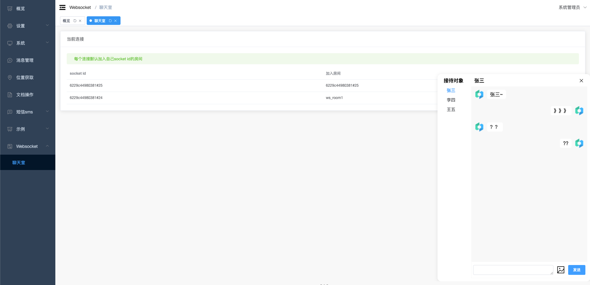

# 介绍
websocket是计划封装所有websocket相关的操作，例如客服聊天室、应用监听等操作。

# 安装

```shell
php bin/hyperf.php hcms:install websocket
```
### 依赖
- redis
### composer 依赖
```shell
 composer require "hyperf/websocket-server"
 composer require "hyperf/socketio-server"
```

# 配置
- `config/autoload/server.php`
```php
  'name' => 'socket-io',
    'type' => Server::SERVER_WEBSOCKET,
    'host' => '0.0.0.0',
    'port' => 9502,
    'sock_type' => SWOOLE_SOCK_TCP,
    'callbacks' => [
        Event::ON_HAND_SHAKE => [Hyperf\WebSocketServer\Server::class, 'onHandShake'],
        Event::ON_MESSAGE => [Hyperf\WebSocketServer\Server::class, 'onMessage'],
        Event::ON_CLOSE => [Hyperf\WebSocketServer\Server::class, 'onClose'],
    ],
```
- 因为默认的ping/pong超时时间是100ms，建议使用`SocketIOFactory`对参数进行设置
```php
// config/autoload/dependencies.php
return [
    Hyperf\SocketIOServer\SocketIO::class => \App\Application\Websocket\Kernel\SocketIOFactory::class
];
```

# 聊天室

## 使用

### websocket-chat 组件

为了方便理解websocket上使用，模块上封装了一个聊天室功能，目前支持文本和图片两种消息格式。后期可以扩展组件和消息处理对象`AbstractMsg.php` 对可发送消息进行扩展。
- ws_host 主机域名
- ws_user_target 用户凭证

### user_target

1. 在前端封装的组件中，有ws_user_target传参，这个可以是用户token，过去其他能够证明用户的凭证。
2. MsgService 封装了 `getUserTarget` 方法可以在这里对这个凭证进行校验，并且可以返回实际用户的凭证、例如用户的ID `user_id`


